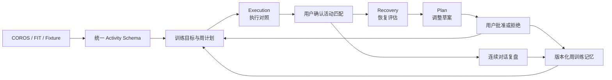

# RunCrew

RunCrew 是一个由真实跑步数据驱动、强调证据与人工确认的本地多 Agent 训练运营系统。它不是把多个角色名称拼进 Prompt，而是让 Execution、Recovery、Plan 三个隔离职责围绕同一训练状态协作，并用 Skill、Context、Harness、Loop、Trace 和版本化 Evaluation 约束整个过程。

用户可以在网页完成：创建训练目标、预览并激活周计划、查看今日训练、确认活动匹配、连续对话复盘、记录跑后反馈、运行跨职责评估、审核计划调整和查看周总结。

## 为什么做这个项目

跑步平台通常可以记录活动，聊天模型也可以生成训练建议，但“计划了什么、实际完成了什么、身体反馈如何、是否需要调整”经常彼此割裂。RunCrew 试图把这些状态接成一个可追溯闭环，同时解决三个 Agent 工程问题：

- 数据事实不能由 LLM 编造，个人结论必须能追溯到规范化 Activity 或确定性 evidence；
- Agent 可以生成候选和草案，但不能绕过用户直接修改训练事实；
- 多职责协作必须可以测试、回放和审计，而不只是一次看起来合理的对话。

## 核心闭环



候选活动只有经过用户确认才成为执行事实；计划草案在批准前会由服务端重放并校验 `input_hash`，正式写入还受计划 `revision` 保护。

## 当前验证结果

| 维度 | 当前结果 |
|---|---:|
| 自动化测试 | 153 passed |
| 多 Agent 确定性评测 | 18 / 18 |
| DeepSeek 单 Agent 同题评测 | 12 / 12 |
| 连续对话上下文窗口 | 最近 8 条消息 + 不可变 evidence 快照 |
| 数据与服务边界 | 本地 SQLite + `127.0.0.1` |

## 技术栈与分层

- Python 3.11+、Pydantic、SQLAlchemy、SQLite、Typer、HTTPX；
- DeepSeek Tool Calls、MCP、OAuth 2.0 + PKCE、Garmin FIT SDK；
- 原生 HTML/CSS/JavaScript 本地产品界面；
- Pytest、版本化 JSON Schema、确定性与真实 LLM 同题 Evaluation。

```text
providers/   外部数据接入、OAuth/MCP、FIT 获取与解析
domain/      与厂商无关的 Activity、训练周期和 Agent Schema
services/    同步、复盘、计划、执行、恢复和产品编排
harness/     工具权限、Handoff、预算、重试、超时、Loop 与 Trace
evaluation/  单 Agent、连续对话和多 Agent 版本化评测
web/         本地聊天产品与工程观测台
skills/      中文 Skill 说明、边界和输入输出契约
```

## 当前能力

- 将 Provider 数据转换为统一的 `ActivitySummary` / `ActivityDetail`；
- 原始数据和规范化数据分层保存；
- 通过 `provider + external_id` 幂等同步；
- COROS 详情失败时按“详情 → 分圈 → FIT”降级，并缓存私有 FIT；
- 用确定性规则生成可审计的单次跑步复盘；
- 用 `review-running-training` Skill 复盘训练完成度、七天负荷变化和训练异常；
- 通过 `input_hash + ruleset_version` 回放同一结论；
- 通过 `agent review` 在白名单、预算、超时和输出校验约束下运行 Skill；
- 输出成功、失败、超时或预算耗尽终态，以及完整脱敏 Trace；
- 用 12 个版本化离线场景评测任务完成、故障恢复、护栏和预算行为；
- 输出 Suite Hash、事实一致性、工具执行和调用成本等可比较指标；
- 提供 `DeepSeekReviewPolicy` 非思考 Tool Calls 适配器，并以 Mock 验证请求、解析、重试、脱敏和 Harness 护栏；
- 在评测报告 1.1 中统计 Policy 调用、API 尝试、动作解析错误、Token 和模型耗时；
- 在本地聊天工作区选择一场跑步，围绕活动和最近训练连续追问；
- 首轮对话运行 Training Review Agent 并保存证据快照，后续只携带最近 8 条消息；
- 个人数据事实/推断必须引用 evidence；通用知识、假设和训练建议可以自然展开并明确标注类型；
- 离线回答默认可用；显式开启后可把脱敏上下文交给 DeepSeek 生成结构化回答；
- 对话、回答 evidence、置信度和缺失数据持久化到本机 SQLite；
- 原只读 Dashboard 保留为工程观测台，展示 Skill evidence、Agent Trace 和 Same-Hash 评测对照；
- 用7个场景、8个轮次评测 grounding、openness、safety 和长上下文行为；
- 使用不含位置的合成 FIT 进行离线开发和回归测试。
- 管理训练目标、周计划、主观身体反馈和计划变更提案；
- 激活后的计划不能由 Agent 直接修改，只有用户批准的提案才能递增版本并生效。
- 通过确定性的恢复风险 Skill 综合近期训练、身体反馈与下一课表，输出带 evidence 的训练决策边界；
- 心肺红旗会停止自动训练建议；疲劳、睡眠和训练量阈值明确标记为项目保守规则，不冒充医疗诊断。
- Coach 通过最小 Context、类型化 Handoff、节点权限、预算和 Trace 编排 Execution、Recovery 与 Plan；
- 计划调整只能生成草案，用户批准前服务端重放并用 revision/stale 防止旧建议覆盖新计划；
- 用18个版本化多 Agent 场景评测任务、韧性、护栏、证据血缘、确认边界与批准前状态漂移。
- 管理经过用户显式确认的长期长跑日偏好，保留来源、有效期、替代链和停用状态；Planning Agent 使用偏好时将其写入 `input_hash` 与 evidence，偏好变化会使旧计划草案失效。
- 将正式计划、已确认执行、规范化 Activity、Check-in 和已批准变更确定性结算为版本化周训练记忆；Planning Agent 优先消费有效记忆，失效或被替代版本不会进入新计划。

## 文档导航

| 想了解什么 | 文件 |
|---|---|
| 项目为什么存在 | [项目上下文](docs/PROJECT_CONTEXT.md) |
| 项目各阶段如何实施、面试如何讲 | [项目实施全景与面试说明](docs/RunCrew-项目实施全景与面试说明.md) |
| 目前做到哪里、下一步是什么 | [当前状态](docs/CURRENT_STATE.md) |
| 为什么下一阶段推荐 DeepSeek、如何接入 | [M5-B DeepSeek 模型选型与接入方案](docs/M5-B-DeepSeek模型选型与接入方案.md) |
| 模块如何协作 | [系统架构](docs/ARCHITECTURE.md) |
| 如何准备五分钟可重复演示 | [求职演示包](docs/demo/README.md) |
| 简历怎么写、面试怎么讲 | [求职材料与证据包](docs/job/README.md) |
| 后续阶段 | [开发路线图](docs/ROADMAP.md) |
| 每阶段做了什么 | [进展索引](docs/PROGRESS.md) |
| 为什么做这些技术选择 | [ADR 索引](docs/adr/README.md) |
| 术语是什么意思 | [术语表](docs/GLOSSARY.md) |
| 如何参与开发 | [开发约定](CONTRIBUTING.md) |
| 私人数据如何处理 | [安全与隐私](SECURITY.md) |
| 项目发生过哪些变化 | [变更日志](CHANGELOG.md) |

## 本地运行

Windows PowerShell，建议使用 Python 3.11 及以上版本：

```powershell
python -m venv .venv
.\.venv\Scripts\python.exe -m pip install -e ".[dev]"
.\.venv\Scripts\runcrew.exe init-db
.\.venv\Scripts\runcrew.exe sync --provider fixture --days 30
.\.venv\Scripts\runcrew.exe demo
```

然后打开 `http://127.0.0.1:8766`。首次体验不需要 DeepSeek Key，fixture 和离线证据回答即可运行；停止服务请在终端按 `Ctrl+C`。

完整验证：

```powershell
.\.venv\Scripts\python.exe scripts\verify.py
```

默认数据库位于 `data/runcrew.db`。真实 COROS 接入位于统一 Provider 接口之下，业务层不依赖 COROS 的原始文本格式。

## 启动本地产品

```powershell
.\.venv\Scripts\runcrew.exe demo
```

默认打开 `http://127.0.0.1:8766`。根页面是跑步数据聊天工作区，可以：

- 选择具体跑步并创建持久化对话；
- 询问本次完成度、七天负荷、配速异常、证据或缺失数据；
- 围绕同一份证据快照连续追问；
- 自由讨论训练假设、通用跑步知识和下一步思路，并区分个人事实、推断、知识和建议；
- 查看回答引用的 evidence、置信度、缺失数据、Token 和估算费用；
- 显式开启 DeepSeek 回答，或在没有 Key 时使用离线证据回答。
- 点击“训练闭环”创建目标、预览并确认下一周计划；
- 查看今日/下一节训练，对候选活动进行确认、跳过或解除；
- 从已确认活动直接进入连续对话复盘；
- 保存跑后反馈，运行 Execution、Recovery、Plan 联合评估并审核调整；
- 查看到期训练确认率、计划时长、反馈天数和周总结。
- 结算上一完整训练周，查看记忆版本、确认完成量、恢复反馈、缺失数据与来源边界。

原来的工程展示页位于 `http://127.0.0.1:8766/engineering`。服务只绑定本机回环地址；聊天 API 允许写入本地会话，但不会向浏览器返回 Provider 外部 ID、原始事件、坐标或 Token。停止服务请在终端按 `Ctrl+C`。不希望自动打开浏览器时使用：

```powershell
.\.venv\Scripts\runcrew.exe demo --no-open-browser
```

## 运行多轮聊天评测

离线基线不调用模型：

```powershell
.\.venv\Scripts\runcrew.exe eval running-chat `
  --output data\private\evals\running-chat-offline-v1.0.json
```

真实 DeepSeek 评测只使用合成跑步数据，并要求显式付费确认与共享费用上限：

```powershell
.\.venv\Scripts\runcrew.exe eval deepseek-chat-suite `
  --confirm-paid-api `
  --max-total-estimated-cost-usd 0.01 `
  --output data\private\evals\running-chat-deepseek-v1.0.json
```

## 管理训练闭环

M7-A 提供本地 `cycle` 命令组，用于创建目标、周计划、主观反馈和计划变更。先查看所有命令：

```powershell
.\.venv\Scripts\runcrew.exe cycle --help
```

激活后的计划不能直接编辑。计划 Agent 或恢复 Agent 未来只能创建变更提案，用户通过 `change-decide` 批准后才会生效；如果计划 revision 已变化，旧提案会标记为 `stale`。

恢复风险评估：

```powershell
.\.venv\Scripts\runcrew.exe recovery assess `
  --goal-id <目标ID> `
  --provider coros
```

该命令不会直接修改课表，也不进行伤病诊断。缺少近期身体反馈时返回数据不足；出现结构化心肺红旗时停止自动训练建议。

生成待确认的周计划草案：

```powershell
.\.venv\Scripts\runcrew.exe planning draft `
  --goal-id <目标ID> `
  --week-start 2026-08-17 `
  --provider coros
```

根据最新恢复评估生成待确认的调整提案参数：

```powershell
.\.venv\Scripts\runcrew.exe planning adjust `
  --goal-id <目标ID> `
  --provider coros
```

两条 `planning` 命令都不会写入或批准正式计划。具体增量与降级幅度是版本化的 RunCrew 保守工程规则，不是医学标准。

对照计划课与实际跑步：

```powershell
.\.venv\Scripts\runcrew.exe execution compare `
  --plan-id <计划ID> `
  --provider coros
```

系统只生成候选，不会自动关联或把缺少活动判成跳过。确认匹配时使用对照结果中的 revision：

```powershell
.\.venv\Scripts\runcrew.exe execution decide `
  --plan-id <计划ID> `
  --base-revision <revision> `
  --session-id <计划课ID> `
  --decision confirm_match `
  --activity-id <RunCrew活动ID>
```

也可以使用 `mark_skipped` 或 `clear_execution`。成功写入会提升计划 revision 并保留审计记录。

运行跨职责 Coach 工作流：

```powershell
.\.venv\Scripts\runcrew.exe coach run `
  --goal-id <目标ID> `
  --plan-id <激活计划ID> `
  --provider coros
```

Coach 会依次委派训练执行和恢复评估；只有需要降级时才调用计划节点。计划节点只返回待确认草案，命令不会保存、批准或修改正式计划。缺少新鲜反馈或出现安全红旗时，工作流会明确阻断。

也可以启动本地产品后点击顶部“训练闭环”：

```powershell
.\.venv\Scripts\runcrew.exe demo
```

页面可以创建目标、预览并激活周计划、核对活动匹配、记录身体反馈、运行 Coach、恢复历史运行并批准或拒绝建议。浏览器不能提交计划 patch；计划激活和 Coach 批准都会先在服务端重放，只有依据未变化才通过 hash/revision 状态机应用，否则拒绝旧操作。

长期训练偏好也可以通过 CLI 管理：

```powershell
.\.venv\Scripts\runcrew.exe memory remember-long-run-day --weekday sun --confirm
.\.venv\Scripts\runcrew.exe memory list
```

如果只想查看完整产品闭环，不使用个人跑步数据，可以准备隔离的合成演示数据库：

```powershell
.\.venv\Scripts\runcrew.exe demo-seed --reset
.\.venv\Scripts\runcrew.exe demo --db data\private\demo\runcrew-demo.db
```

架构图、训练闭环时序图和五分钟演示顺序见 [求职演示包](docs/demo/README.md)。

当前 v1 只支持会被周计划真实消费的长跑星期偏好；普通聊天不会自动写入长期记忆。

## 运行 Coach 多 Agent 离线评测

```powershell
.\.venv\Scripts\runcrew.exe eval coach-agent `
  --output data\private\evals\coach-agent-v1.0.json
```

`coach-agent-eval/1.0` 包含18个无私人数据场景，直接运行真实 Coach Harness，并用临时 SQLite 验证批准前 stale 防护。当前确定性基线18/18通过，报告的 Suite Hash 用于未来 LLM Coach Policy 同题比较。该命令不调用外部模型，报告只能写入 `data/private/`。

## 同步真实 COROS 数据

```powershell
runcrew sync --provider coros --days 30 --detail-limit 1
runcrew activities review --latest --provider coros
```

命令会打开 COROS 官方授权页，并在 `127.0.0.1:8765` 临时接收 PKCE 回调。当前里程碑不持久化访问令牌或刷新令牌，因此每次真实同步都需要重新授权。

如果 COROS 的活动详情与分圈工具临时不可用，Provider 会请求一条 FIT 下载地址，并使用 Garmin 官方 SDK 确定性解析。FIT 缓存在 `data/private/fit/`，文件名不含 LabelId；缓存命中时不会再次消耗下载额度。若三级详情来源均失败，活动列表仍会入库，CLI 返回 `completed_with_warnings` 和 `detail_errors`，不会把 summary 伪装成 detail。

只读查看某个 COROS MCP 工具的当前 schema：

```powershell
.\.venv\Scripts\python.exe scripts\inspect_coros_tool.py queryActivityFitFileDownloadUrls
```

## 运行 Training Review Skill

```powershell
.\.venv\Scripts\runcrew.exe training review --latest --provider coros
```

如果已知本次训练计划，可以显式传入目标：

```powershell
.\.venv\Scripts\runcrew.exe training review --latest --provider coros `
  --planned-distance-km 8 --planned-duration-minutes 45
```

缺少计划或历史训练负荷时，Skill 会返回 `unknown` 和所需数据，不会猜测结论。

## 运行训练复盘 Agent

```powershell
.\.venv\Scripts\runcrew.exe agent review --latest --provider coros
```

Agent 输出在 Training Review 之外增加 `run_id`、终态、退出原因、预算使用和 Trace。默认业务 CLI 仍使用确定性 Policy；DeepSeek 已完成同 Hash 完整评测，但当前结论只覆盖一个工具和两种动作，不能描述成生产级复杂规划系统。

## 运行 Agent 离线评测

```powershell
.\.venv\Scripts\runcrew.exe eval review-agent `
  --output data\private\evals\m5-baseline.json
```

评测包含 12 个无私人数据场景，覆盖正常任务、缺数降级、瞬时恢复、超时、非法输出、越权、参数篡改、确认和预算。评测用例可以进入 Git，报告只能写入 `data/private/`。当前基线不调用真实 LLM。

## 真实模型评测结论

M5-B3 已完成。`deepseek-v4-flash` 非思考模式与确定性 Policy 在完全相同的 `review-agent-eval/1.1` Suite 和15秒预算下均为 12/12 通过，Hash 均为 `2b89473f...`。DeepSeek 没有动作解析错误或越权工具执行，总费用约 0.000762 美元；当前没有证据支持升级 Pro 或拆分多 Agent。详见 [最终评测报告](docs/M5-B3-DeepSeek最终评测报告.md)。

完整 Suite 命令复用12个合成场景，并要求同时传入 `--confirm-paid-api` 和共享总费用上限；缺少 Key、确认或费用上限时会在联网前退出：

```powershell
.\.venv\Scripts\runcrew.exe eval deepseek-suite `
  --confirm-paid-api `
  --max-total-estimated-cost-usd 0.01 `
  --output data\private\evals\deepseek-suite.json
```
