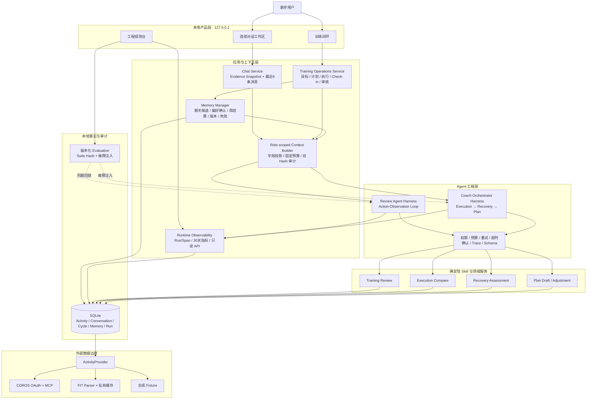

# RunCrew 系统架构图

## 面试讲解顺序

1. 最下面是数据可信边界：外部格式先经过 Provider 和 Parser 变成统一 Activity；
2. 中间是确定性 Skill：计算、阈值、缺失数据和 evidence 不交给 LLM；
3. Harness 掌握工具白名单、确认、预算、超时、Trace 和终态，Policy 只有建议权；
4. 应用层先把聊天表达隔离为待确认 Candidate，确认时校验原消息与 Hash；正式记忆再按职责裁剪 Context：Execution 不读记忆，Recovery 只读周聚合，Plan 读取偏好和训练基线；
5. Review/Coach Trace 通过 best-effort 短事务进入统一 Run/Span；工程观测台从30天事实重算指标，并与不污染产品样本的合成治理评测并列展示；
6. Evaluation 复用真实 Harness，而不是为测试重写一套模拟流程。
