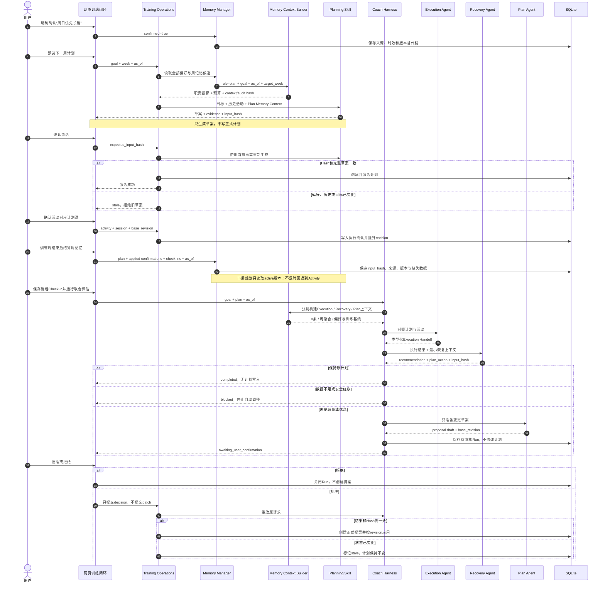

# 训练闭环时序图

```mermaid
sequenceDiagram
    autonumber
    actor User as 用户
    participant Web as 网页训练闭环
    participant Ops as Training Operations
    participant Memory as Memory Manager
    participant Context as Memory Context Builder
    participant Planning as Planning Skill
    participant Coach as Coach Harness
    participant Exec as Execution Agent
    participant Recovery as Recovery Agent
    participant Plan as Plan Agent
    participant DB as SQLite

    User->>Web: 明确确认“周日优先长跑”
    Web->>Memory: confirmed=true
    Memory->>DB: 保存来源、时效和版本替代链

    User->>Web: 预览下一周计划
    Web->>Ops: goal + week + as_of
    Ops->>Memory: 读取全部偏好与周记忆候选
    Memory->>Context: role=plan + goal + as_of + target_week
    Context-->>Ops: 职责投影 + 预算 + context/audit hash
    Ops->>Planning: 目标 + 历史活动 + Plan Memory Context
    Planning-->>Web: 草案 + evidence + input_hash
    Note over Planning,Web: 只生成草案，不写正式计划

    User->>Web: 确认激活
    Web->>Ops: expected_input_hash
    Ops->>Planning: 使用当前事实重新生成
    alt Hash和完整草案一致
        Ops->>DB: 创建并激活计划
        Ops-->>Web: 激活成功
    else 偏好、历史或目标已变化
        Ops-->>Web: stale，拒绝旧草案
    end

    User->>Web: 确认活动对应计划课
    Web->>Ops: activity + session + base_revision
    Ops->>DB: 写入执行确认并提升revision

    User->>Web: 训练周结束后结算周记忆
    Web->>Memory: plan + applied confirmations + check-ins + as_of
    Memory->>DB: 保存input_hash、来源、版本与缺失数据
    Note over Memory,Planning: 下周规划只读取active版本；不足时回退到Activity

    User->>Web: 保存跑后Check-in并运行联合评估
    Web->>Coach: goal + plan + as_of
    Coach->>Context: 分别构建Execution / Recovery / Plan上下文
    Context-->>Coach: 0条 / 周聚合 / 偏好与训练基线
    Coach->>Exec: 对照计划与活动
    Exec-->>Coach: 类型化Execution Handoff
    Coach->>Recovery: 执行结果 + 最小恢复上下文
    Recovery-->>Coach: recommendation + plan_action + input_hash
    alt 保持原计划
        Coach-->>Web: completed，无计划写入
    else 数据不足或安全红旗
        Coach-->>Web: blocked，停止自动调整
    else 需要减量或休息
        Coach->>Plan: 只准备变更草案
        Plan-->>Coach: proposal draft + base_revision
        Coach->>DB: 保存待审核Run，不修改计划
        Coach-->>Web: awaiting_user_confirmation
    end

    User->>Web: 批准或拒绝
    alt 拒绝
        Web->>DB: 关闭Run，不创建提案
    else 批准
        Web->>Ops: 只提交decision，不提交patch
        Ops->>Coach: 重放原请求
        alt 结果和Hash仍一致
            Ops->>DB: 创建正式提案并按revision应用
        else 状态已变化
            Ops->>DB: 标记stale，计划保持不变
        end
    end
```

这张图的核心不是三个 Agent 名称，而是事实确认、读取最小权限和写入权限边界：长期偏好写入、计划激活、执行匹配、计划调整批准都由用户确认；周训练记忆只能从这些正式事实结算。不同职责只收到允许字段和固定预算，任何一步的事实或 Hash 变化都会拒绝旧操作或产生新记忆版本。
